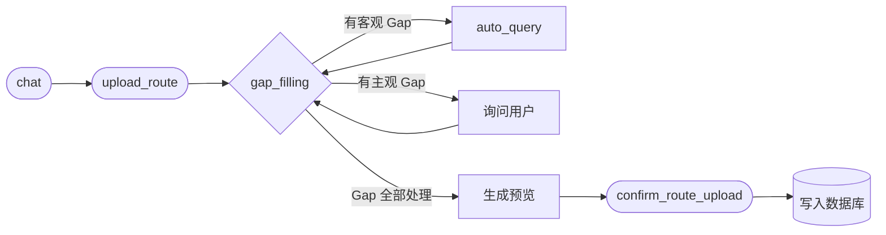

# 路线上传 Agent 功能 — 产品设计文档

> 文档版本：v0.1（Draft）
> 创建日期：2026-04-03
> 状态：待确认

---

## 一、背景与目标

### 1.1 现状问题

目前 WeGO 路线的来源只有两种：
1. **人工 seed 脚本**：通过 `data/scripts/seed-*.js` 将 JSON 文件手动注入数据库
2. **Agent plan_route 工具**：基于固定候选池（8 个大栅栏景点）生成路线，无法查询真实 POI

缺乏一个让运营人员或普通用户**自助上传路线内容**的机制，上传后由 AI Agent 自动解析、结构化、校验、补全，最终由人确认后写入数据库。

### 1.2 目标

- 支持多种格式（JSON / Markdown / 纯文本 / URL 抓取）上传路线内容
- Agent 自动解析文件，识别路线结构和景点列表
- 对缺失的客观字段（经纬度等），Agent 自动查询并呈现结果，用户确认后采纳
- 对缺失的主观字段（介绍/故事等），Agent 以对话方式询问用户
- 全程 Agent 驱动，用户始终掌握最终确认权
- 解析完成后输出 `route-ingestion.schema.json` 格式预览，用户二次确认后方可写入数据库

---

## 二、核心流程

### 2.1 整体流程图

```mermaid
flowchart TD
    A[用户触发上传] --> B{上传入口}
    B --> B1[AI 对话入口<br/>「上传路线」指令]
    B --> B2[独立上传页面<br/>拖拽/粘贴/选择文件]
    B --> B3[粘贴 URL<br/>自动抓取内容]

    B1 --> C[Edge Function<br/>route-ingest 接收]
    B2 --> C
    B3 --> C

    C --> D[Agent 启动 upload_route 节点]
    D --> E[解析文件格式<br/>JSON / Markdown / TXT / URL]
    E --> F{解析成功?}

    F -->|失败| G[返回错误<br/>告知修正位置]
    F -->|成功| H[提取路线结构<br/>title / spots[] / metadata]

    H --> I[逐 Spot 检查字段完整性]
    I --> J{发现 Gap?}
    J -->|是| K[Gap 分类]
    K --> K1[客观 Gap<br/>lat/lng / tags / duration]
    K --> K2[主观 Gap<br/>subtitle / detail / short_desc]

    K1 --> L1[Agent 调用外部 API 自动查询]
    L1 --> L2[展示查询结果<br/>用户确认采纳]
    L2 --> M1{用户确认?}

    K2 --> N1[Agent 对话询问用户]
    N1 --> N2{用户回复}
    N2 -->|有补充| N3[Agent 采纳并更新字段]
    N2 -->|跳过| N4[标记 optional<br/>保留 null]
    N3 --> J
    N4 --> J

    M1 -->|是| J
    M1 -->|否| J

    J -->|全部必填项完成<br/>或有结果| O[生成 route-ingestion 格式预览]
    O --> P[展示预览<br/>用户二次确认]
    P --> Q{用户确认?}

    Q -->|确认| R[写入 routes 表<br/>写入 spots 表<br/>status: active]
    Q -->|拒绝| S[返回编辑状态<br/>保留草稿]
    Q -->|继续补充| K

    R --> T((结束))
    S --> U[用户手动编辑后<br/>重新触发确认])
```

### 2.2 状态机

```
draft（草稿）
  ↓ 上传文件
parsing（解析中）
  ↓ 解析成功
gap_filling（缺失补充）
  ↓ 所有必填 Gap 均已处理
pending_review（待确认）
  ↓ 用户二次确认
confirmed（已确认）
  ↓ 写入数据库
active（已上线）←——— 终态

pending_review → editing（用户主动编辑）
active → editing（用户申请修改）
```

---

## 三、上传入口

### 3.1 AI 对话入口

**触发词**：「上传路线」「导入路线」「我想添加一条路线」

**交互示例**：

```
用户：上传路线（附件：route.json）
Agent：收到路线文件，正在解析…
      ✓ 文件格式：JSON
      ✓ 路线标题：京城胡同游
      ✓ 景点数量：6

      发现 2 处内容缺失，需要您的帮助：

      🅿️ 景点「炭儿胡同」的「详细介绍」为空
         这个景点有什么历史故事或特色玩法吗？
         （可以直接粘贴文字，我会整理后补入）

      🅿️ 景点「大栅栏」的「标签」未填写
         这个景点最适合哪种游客？
         A. 亲子家庭  B. 情侣约会  C. 摄影爱好者  D. 文化探索者
```

### 3.2 独立上传页面

**路径**：`/upload-route`（独立页面，可通过底部 Tab 或设置页进入）

**功能模块**：
1. **文件上传区**：支持拖拽上传（JSON / Markdown / TXT），或点击选择文件
2. **URL 抓取区**：输入网页 URL，Agent 自动抓取并解析页面内容
3. **纯文本粘贴区**：直接粘贴路线文字描述
4. **解析历史**：展示本次会话中已上传/解析过的路线草稿列表

### 3.3 URL 抓取

支持抓取以下来源：
- 马蜂窝景点攻略页面
- 小红书笔记 URL
- 微信公众号文章
- 携程/去哪儿景点页面

> 注：URL 抓取依赖 `clean-content-fetch`（飞书 skill）或类似网页正文提取工具，需确认工具可用性。

---

## 四、文件格式支持

### 4.1 JSON（标准格式）

完全符合 `route.schema.json` 或 `route-ingestion.schema.json`，Agent 直接 Schema 校验并映射。

```json
{
  "title": "京城胡同游",
  "description": "从杨竹梅斜街到炭儿胡同，感受老北京的烟火气",
  "duration_minutes": 180,
  "difficulty": "easy",
  "tags": ["胡同", "文化", "摄影"],
  "cover_image": "https://example.com/cover.jpg",
  "total_distance_km": 3.2,
  "spots": [
    {
      "name": "杨竹梅斜街",
      "subtitle": "老北京的烟火气",
      "lat": 39.8973,
      "lng": 116.3976,
      "sort_order": 1
    }
  ]
}
```

### 4.2 JSON（简化格式）

仅有路线标题和景点列表，细节由 Agent 推断或询问补全。

```json
{
  "title": "京城胡同游",
  "spots": [
    { "name": "杨竹梅斜街", "desc": "老北京的烟火气" },
    { "name": "炭儿胡同", "desc": "" }
  ]
}
```

### 4.3 Markdown 格式

```markdown
# 京城胡同游

从杨竹梅斜街到炭儿胡同，感受老北京的烟火气。全程约 3 小时，难度 easy。

## 景点列表

### 1. 杨竹梅斜街
老北京的烟火气胡同，建议停留 30 分钟。
坐标：39.8973, 116.3976

### 2. 炭儿胡同
（暂无介绍）
```

### 4.4 纯文本格式

完全自由文本，Agent 依赖 LLM 理解能力提取路线结构和景点信息。

---

## 五、Agent Gap 处理策略

### 5.1 Gap 分类

| 类型 | 字段 | 处理方式 |
|---|---|---|
| **客观 Gap** | `lat` / `lng`（经纬度） | Agent 自动查询，用户确认后采纳 |
| **客观 Gap** | `estimated_stay_min`（建议停留时长） | Agent 规则库推断，无需确认 |
| **客观 Gap** | `tags`（标签） | Agent 推断，用户确认后采纳 |
| **客观 Gap** | `cover_image`（封面图） | Agent 搜索配图，用户确认后采纳 |
| **主观 Gap** | `subtitle`（副标题） | Agent 询问用户 |
| **主观 Gap** | `detail`（详细介绍） | Agent 询问用户 |
| **主观 Gap** | `short_desc`（短描述） | Agent 询问用户 |
| **客观 Gap** | `total_distance_km`（总距离） | Agent 基于各 Spot 坐标计算，无需确认 |
| **客观 Gap** | `duration_minutes`（总时长） | Agent 汇总各 Spot 停留时长，无需确认 |

### 5.2 经纬度查询流程

```
Agent 发现「xxx」景点缺少经纬度
  ↓
Agent 调用高德地图 Geocoding API（通过 web_search 或专用工具）
  ↓
查询到结果：lat: 39.8973, lng: 116.3976（置信度：高）
  ↓
展示给用户：
「已通过高德地图自动查询到「xxx」的坐标：
  📍 纬度：39.8973
  📍 经度：116.3976
  是否确认采纳？[确认] [修改] [跳过]」
  ↓
用户选择
  ├ 确认 → 字段更新为 39.8973, 116.3976
  ├ 修改 → 弹出输入框，用户填写后更新
  └ 跳过 → 保留 null（作为草稿保留，不影响上传）
```

**无法自动查询的情况**：
- 景点名称过于模糊
- 地点不存在或已拆除

```
Agent：
「无法自动定位「yyy」，因为地点名称不够具体。
请提供以下任一信息：
  1. 具体地址（如：北京市西城区大栅栏胡同XX号）
  2. 周边地标（如：位于大栅栏商场东侧50米）
  3. 或者直接描述它的位置关系」
```

### 5.3 主观内容对话补全流程

```
Agent：
「景点「炭儿胡同」的「详细介绍」为空。
这个景点有什么历史故事或特色玩法吗？
可以直接粘贴文字或语音转文字，我会整理后补入。」

用户：我家就在这附近，这条胡同最有意思的是晚上看大爷下棋，还有
      一家开了30年的卤煮店，味道特别正宗

Agent：
「已采纳！整理后补充如下：

详细介绍：
这条胡同最有意思的是晚上看大爷下棋，还有一家开了30年的卤煮
店，味道特别正宗。

是否需要补充更多细节？[确认] [再补充]」
```

---

## 六、二次确认预览

当 Agent 完成所有必填项处理（或用户跳过可选项）后，生成预览报告：

```
═══════════════════════════════════════════════
              📋 路线预览报告
═══════════════════════════════════════════════

路线名称：京城胡同游
路线描述：从杨竹梅斜街到炭儿胡同，感受老北京的烟火气
难度：easy（轻松）
总时长：约 180 分钟
总距离：约 3.2 km
标签：#胡同 #老北京 #文化 #摄影
封面图：https://example.com/cover.jpg ✓

───────────────────────────────────────────────
🅿️ 景点列表（6 个）
───────────────────────────────────────────────

① 杨竹梅斜街
   ├ 副标题：老北京的烟火气 ✓
   ├ 纬度：39.8973 ✓（高德已确认）
   ├ 经度：116.3976 ✓（高德已确认）
   ├ 建议停留：30 分钟 ✓（自动推断）
   ├ 详细介绍：... ✓
   └ 状态：✅ 完整

② 炭儿胡同
   ├ 副标题：（已补充 ✓）
   ├ 纬度：39.8961 ✓（高德已确认）
   ├ 经度：116.3989 ✓（高德已确认）
   ├ 建议停留：20 分钟 ✓（自动推断）
   ├ 详细介绍：... ✓
   └ 状态：✅ 完整

③ 西打磨厂街
   ├ 副标题：❌ 待补充
   ├ 纬度：39.8952 ✓
   ├ 经度：116.3991 ✓
   ├ 建议停留：15 分钟 ✓
   ├ 详细介绍：❌ 待补充
   └ 状态：⚠️ 部分缺失（副标题 / 详细介绍为选填）

───────────────────────────────────────────────
⚠️ 选填项提示：副标题和详细介绍为选填项，
   留空不影响上传，但可能影响用户体验。
───────────────────────────────────────────────

═══════════════════════════════════════════════

[💾 确认上传到数据库]  [✏️ 继续编辑补充内容]  [🗑 取消上传]

═══════════════════════════════════════════════
```

---

## 七、数据库写入

### 7.1 写入时机

用户点击「确认上传」后，Agent 执行写入操作，写入后状态变更为 `active`。

### 7.2 写入操作

```sql
-- 1. 写入 routes 表
INSERT INTO routes (
  id, title, description, duration_minutes, difficulty,
  tags, cover_image, total_distance_km,
  created_at, updated_at
) VALUES (
  gen_random_uuid(), -- 或用户指定的 id
  '京城胡同游', '从杨竹梅斜街到炭儿胡同...',
  180, 'easy',
  ARRAY['胡同', '老北京', '文化', '摄影'],
  'https://example.com/cover.jpg', 3.2,
  NOW(), NOW()
) RETURNING id;

-- 2. 写入 spots 表（route_id 来自上一步）
INSERT INTO spots (
  id, route_id, name, subtitle, short_desc, detail,
  tags, thumb, photos,
  lat, lng, geofence_radius_m, estimated_stay_min, sort_order,
  created_at, updated_at
) VALUES (...);

-- 3. 记录 ingestion job（审计）
INSERT INTO route_ingestion_jobs (
  route_id, source_file, status, finished_at,
  validation_report, cleaning_report, import_report
) VALUES (
  <route_id>, <source_file>, 'success', NOW(),
  <validation_report_json>, <cleaning_report_json>, <import_report_json>
);
```

### 7.3 写入失败处理

- 写入 `route_ingestion_jobs` 表，`status` 设为 `'failed'`，记录 `error_message`
- Agent 告知用户具体失败原因（如：经纬度超出中国边界、必填字段为空等）
- 用户修正后，可重新触发确认

---

## 八、Agent 工具设计

### 8.1 新增工具：`upload_route`

```python
# agent/tools/upload_route.py

class UploadRouteInput(BaseModel):
    file_content: str          # 文件原始内容
    file_type: Literal["json", "md", "txt", "url"]
    url: str | None = None     # 如果 file_type == "url"
    session_id: str             # 本次上传会话 ID

class UploadRouteOutput(BaseModel):
    session_id: str
    status: Literal["parsing", "gap_filling", "pending_review", "error"]
    route_preview: dict | None   # route-ingestion.schema 格式
    gaps: list[GapItem] | None
    error_message: str | None

class GapItem(BaseModel):
    spot_name: str
    field: str
    gap_type: Literal["objective", "subjective"]
    suggested_value: str | None
    auto_queried: bool = False   # 是否已自动查询
```

**工具内部流程：**
1. 解析文件 → 提取路线结构
2. 逐 Spot 校验必填字段（`route.schema.json`）
3. 对客观 Gap → 调用 `auto_query_coordinates()` 等函数
4. 对主观 Gap → 组织询问话术，返回 `GapItem[]`
5. 汇总结果，返回 `UploadRouteOutput`

### 8.2 新增工具：`confirm_route_upload`

```python
# agent/tools/confirm_route_upload.py

class ConfirmRouteUploadInput(BaseModel):
    session_id: str
    confirmed: bool
    overrides: dict | None = None  # 用户在确认页修改的字段

class ConfirmRouteUploadOutput(BaseModel):
    success: bool
    route_id: str | None
    error_message: str | None
```

**工具内部流程：**
1. 校验 session 状态（必须在 `pending_review` 才能确认）
2. 如 `confirmed=True`，执行 `upsert_routes()` + `upsert_spots()` + `record_ingestion_job()`
3. 返回写入结果

### 8.3 内部辅助函数

| 函数 | 用途 |
|---|---|
| `parse_json_route(content)` | 解析 JSON 格式，返回路线结构 |
| `parse_markdown_route(content)` | 解析 Markdown 格式，提取路线标题和景点列表 |
| `parse_text_route(content)` | 纯文本解析，LLM 提取结构化信息 |
| `fetch_url_content(url)` | 抓取 URL 网页正文 |
| `auto_query_coordinates(spot_name)` | 调用高德 Geocoding API 查询经纬度 |
| `infer_tags_from_spot(spot)` | 基于景点名称和描述推断标签 |
| `infer_stay_duration(spot)` | 规则库 + LLM 推断建议停留时长 |
| `calculate_total_distance(spots)` | 基于各 Spot WGS-84 坐标计算总距离 |
| `upsert_routes(route_data)` | 写入 routes 表 |
| `upsert_spots(route_id, spots)` | 批量写入 spots 表 |
| `record_ingestion_job(...)` | 记录 ingestion job |

---

## 九、技术架构变更

### 9.1 新增文件清单

```
新增后端文件：
agent/tools/upload_route.py          # 路线摄取主工具
agent/tools/confirm_route_upload.py    # 上传确认工具
agent/tools/auto_query.py             # 客观数据自动查询辅助函数

agent/prompts/upload_route.md         # upload_route 工具的 prompt 指令

server/functions/route-ingest/index.js # Edge Function：接收上传请求，触发 Agent
server/migrations/007_route_drafts.sql # 路线草稿表

新增前端文件：
src/components/RouteUploader.tsx       # 文件上传组件（拖拽/粘贴/URL）
src/components/RoutePreview.tsx        # 二次确认预览组件
src/components/GapFillingChat.tsx     # Gap 补全对话界面
src/pages/upload-route/index.tsx      # 独立上传页面

改动文件：
agent/graph.py                        # 新增 upload_route / confirm_route_upload 工具节点
agent/server.py                       # 扩展 /chat 端点，支持 file_content 上传模式
src/App.tsx                           # 路由增加 /upload-route
src/components/ChatPanel.tsx          # 对话入口增加「上传路线」触发
```

### 9.2 数据库新增表

```sql
-- 路线草稿表（存储每次上传会话的中间状态）
CREATE TABLE route_drafts (
  id              UUID        PRIMARY KEY DEFAULT gen_random_uuid(),
  session_id      TEXT        NOT NULL UNIQUE,
  source_file     TEXT,
  source_url      TEXT,
  file_type       TEXT        CHECK (file_type IN ('json', 'md', 'txt', 'url')),
  raw_content     TEXT,
  parsed_data     JSONB,      -- 解析后的 route-ingestion 格式
  status          TEXT        NOT NULL DEFAULT 'draft'
                              CHECK (status IN (
                                'draft', 'parsing', 'gap_filling',
                                'pending_review', 'confirmed', 'active', 'editing'
                              )),
  gap_items       JSONB,      -- 当前 Gap 列表
  user_overrides  JSONB,      -- 用户确认时的覆盖字段
  created_at      TIMESTAMPTZ DEFAULT NOW(),
  updated_at      TIMESTAMPTZ DEFAULT NOW()
);
```

### 9.3 Agent 状态图变更（graph.py）



---

## 十、对话设计（AI 语气）

参考现有 `agent/prompts/personalities/local.md` 中的"老北京玩家"人格，保持以下风格：

- **主动引导**：用北京口语化表达，"哥们儿，这条路线我先帮您过一遍"
- **主动发现**：发现 Gap 时用地道的方式表达，"嘿，这儿缺了点东西"
- **不确定时**：不瞎猜，"这地儿我没把握，您给指点指点"
- **确认时**：给用户充分选择权，"您看这么着成不成"

---

## 十一、非功能性要求

### 11.1 性能
- 单次文件解析（< 50 个 Spot）应在 5 秒内完成
- 高德 API 查询（无缓存时）应在 3 秒内完成，单次查询

### 11.2 容错
- 文件解析失败（语法错误）→ 返回具体错误位置和修正建议
- 高德 API 限流 → 退化为询问用户提供坐标
- 网络不稳定 → 重试 1 次后降级

### 11.3 审计
- 所有上传会话的 `route_drafts` 记录永久保留
- `route_ingestion_jobs` 记录每次写入的 validation_report / cleaning_report / import_report
- Agent 对话记录通过现有 `agent_transcripts` 表存储

---

## 十二、优先级排期

| 优先级 | 功能 | 说明 |
|---|---|---|
| P0 | JSON 标准格式上传 + Schema 校验 | 最简单实现，快速验证流程 |
| P0 | 二次确认预览 + 数据库写入 | 核心闭环 |
| P1 | Markdown / TXT 格式支持 | 扩展适用范围 |
| P1 | 经纬度自动查询（高德 API） | 减少用户摩擦 |
| P2 | 主观 Gap 对话补全 | 提升数据质量 |
| P2 | 独立上传页面 | 降低对话入口的门槛 |
| P3 | URL 抓取（小红书/马蜂窝等） | 高级功能 |

---

## 附录

### A. 高德地图 Geocoding API 集成

高德地图 API 需要 `key` 参数，可通过以下方式配置：

```python
# agent/tools/auto_query.py
import os

AMAP_KEY = os.environ.get("AMAP_API_KEY")  # 从环境变量读取

def auto_query_coordinates(spot_name: str, region: str = "北京") -> dict | None:
    """调用高德地图地理编码 API"""
    # GET https://restapi.amap.com/v3/geocode/geo?key=<KEY>&address=<spot_name>&city=<region>
    # 返回 { lat: number, lng: number, confidence: "high" | "medium" | "low" }
    pass
```

> 注：需用户提供高德地图 API Key，建议存储在 Supabase Vault 或 `.env` 中。

### B. URL 抓取备选方案

若 `clean-content-fetch`（飞书 skill）不可用或不支持目标网站，可使用：
- `firecrawl` skill（支持 JS 渲染页面）
- 直接调用 `https://r.jina.ai/<url>`（Jina Reader，无 API Key）

### C. 相关文档索引

| 文档 | 路径 |
|---|---|
| 路线主 Schema | `contracts/route.schema.json` |
| 景点 Schema | `contracts/spot.schema.json` |
| 路线摄取 Schema | `contracts/route-ingestion.schema.json` |
| 路线规划请求 Schema | `contracts/route-plan-request.schema.json` |
| 路线规划响应 Schema | `contracts/route-plan-response.schema.json` |
| 路线表 Migration | `server/migrations/001_routes.sql` |
| 景点表 Migration | `server/migrations/002_spots.sql` |
| 路线摄取作业表 Migration | `server/migrations/006_route_ingestion_jobs.sql` |
| 路线草稿表 Migration（新建） | `server/migrations/007_route_drafts.sql` |
| Agent 状态图 | `agent/graph.py` |
| Agent 系统 Prompt | `agent/prompts/system.md` |
| 现有路线 seed 脚本 | `data/scripts/seed-route-candidate.js` |
| 北京路线种子数据 | `data/routes/beijing-catalog-seed.json` |
